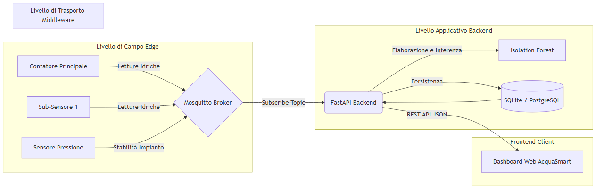
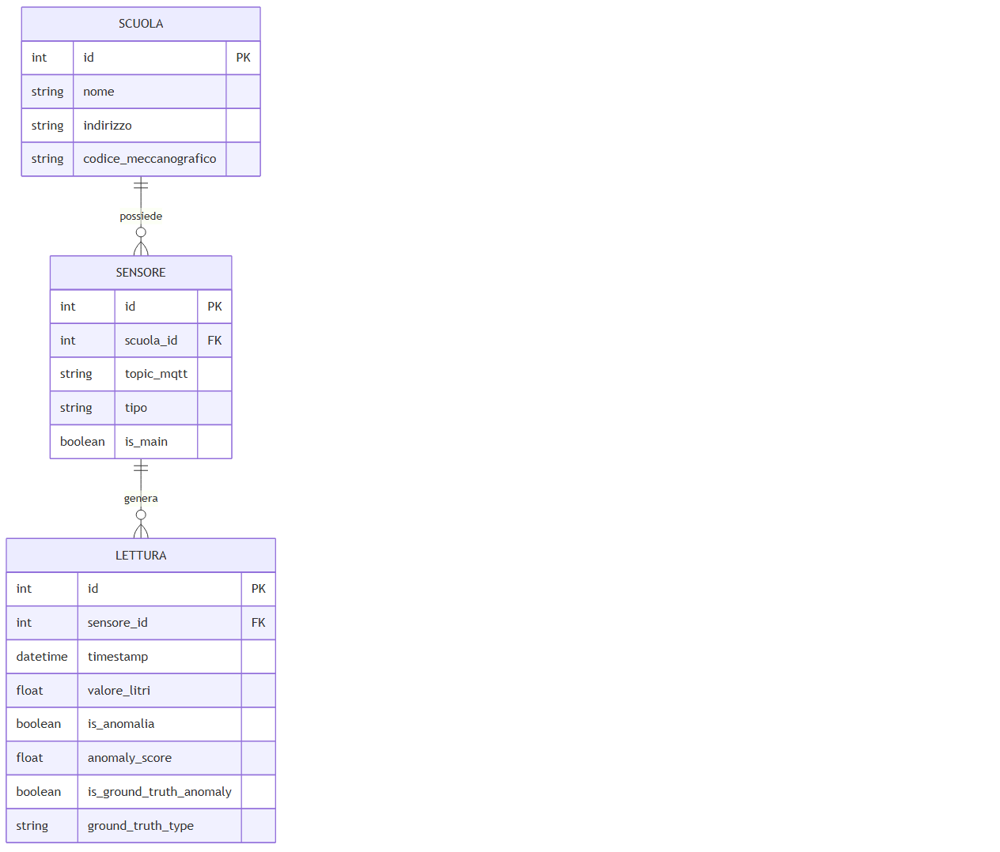

# Capitolo 3 – Implementazione della Piattaforma AcquaSmart

L'implementazione del sistema *AcquaSmart* ha tradotto in realtà operativa i concetti teorici e le scelte architetturali delineate nel capitolo precedente. In questa fase, le tecnologie selezionate sono state integrate per costruire una pipeline di dati fluida e affidabile, dal singolo sensore posizionato sulla rete idrica fino all'interfaccia utente finale. Questo capitolo illustra nel dettaglio le procedure di configurazione, lo sviluppo del backend e della dashboard, la strategia adottata per la simulazione del dataset, corredando il tutto con schemi e snippet di codice fondamentali.

## 3.1 Configurazione del broker MQTT e acquisizione dati
Il cuore della comunicazione telemetrica di *AcquaSmart* è basato sul protocollo MQTT. Per garantire l'instradamento in tempo reale delle letture, si è scelto di utilizzare Mosquitto come broker. La sua natura leggera e la sua elevata scalabilità lo rendono ideale per gestire un flusso continuo di dati (data stream) provenienti da numerosi istituti scolastici.

### Architettura di acquisizione
Di seguito viene presentato lo schema dell'architettura generale del sistema, che illustra il percorso del dato dal livello di campo al livello applicativo:



La topologia dei sensori è stata mappata in modo logico attraverso la struttura dei topic MQTT. Ad esempio, la ricezione dei dati da una specifica scuola segue una nomenclatura gerarchica del tipo `tesi/catania/scuole/{id_scuola}/{id_sensore}`, permettendo al backend di filtrare e indirizzare in modo efficiente le informazioni. L'acquisizione dei dati è garantita in modo asincrono, evitando blocchi (bottleneck) qualora si verificassero picchi di traffico imprevisti.

## 3.2 Sviluppo del backend e logica di smistamento dati
Il backend rappresenta il nucleo logico centrale dell'intera piattaforma. Sviluppato in Python sfruttando il framework FastAPI, esso è preposto all'orchestrazione delle comunicazioni, all'estrazione delle feature per i modelli di Machine Learning e alla persistenza sicura sul database.

Una volta che il broker MQTT riceve il messaggio dal sensore, il backend (che è in perenne ascolto sui topic prestabiliti) intercetta il pacchetto (payload), generalmente in formato JSON. La logica di smistamento dati si articola nelle seguenti fasi:
1. **Validazione e Parsing**: il dato grezzo viene estratto e validato per evitare inconsistenze.
2. **Arricchimento del Dato (Data Enrichment)**: alla lettura viene associato l'orario di acquisizione (timestamp) e l'identificativo esatto del sensore interrogando preventivamente il database.
3. **Elaborazione e Inferenza**: prima del salvataggio, il dato idrico viene sottoposto al modulo predittivo (Isolation Forest) per calcolarne il livello di anomalia (anomaly score).
4. **Persistenza (Storage)**: l'entità completa, integrata dai risultati dell'algoritmo, viene scritta nel database relazionale.

### 



## 3.3 Realizzazione della dashboard web (Applicazione "tesi-acquasmart")
L'interfaccia utente è lo strumento cardine attraverso il quale l'ente pubblico può trasformare l'astrazione dei dati grezzi in un'azione tempestiva. La dashboard web è stata concepita con un design minimalista e data-driven (guidata dai dati), sviluppata con tecnologie standard (HTML, CSS, JavaScript Vanilla) per risultare reattiva e compatibile con qualsiasi browser o dispositivo mobile.

L'applicazione comunica esclusivamente con il backend tramite API RESTful protette, implementando un solido sistema di sicurezza. L'accesso alla piattaforma è infatti vincolato a una schermata di autenticazione iniziale (Login) che richiede credenziali verificate, tutelando così i dati sensibili dell'ente. 
All'interno del portale, le autorizzazioni sono gestite in base ai ruoli: gli utenti dotati di privilegi di amministratore dispongono di un pannello di controllo avanzato tramite il quale è possibile gestire dinamicamente l'infrastruttura, apportare modifiche all'anagrafica, registrare nuove scuole, aggiungere ulteriori sensori IoT alla rete e creare o revocare utenze per gli operatori. 

Le schermate principali offrono:
*   **Panoramica globale (Overview)**: consumo totale aggregato e stato di allarme e salute degli istituti gestiti.
*   **Dettaglio del plesso**: grafici interattivi che delineano le serie storiche dei flussi di ogni singolo sotto-sensore per monitoraggi mirati.
*   **Confronto Dati Reali (Bollette)**: un'area dedicata all'inserimento dei dati reali di fatturazione, permettendo al sistema di incrociare le letture telemetriche stimate con i consumi effettivi documentati dalle bollette idriche, fornendo un termine di paragone essenziale.
*   **Gestione Alert**: una sezione dedicata alle segnalazioni critiche evidenziate dall'algoritmo, fondamentale per aiutare i manutentori a isolare fisicamente i rami dell'impianto interessati dai guasti o da eventuali malfunzionamenti.

## 3.4 Dataset utilizzato: dati reali e generazione tramite simulatore
Una delle sfide più ardue nello sviluppo di sistemi IoT supervisionati e predittivi in contesti specifici è la carenza cronica di dataset pubblici completi e ben bilanciati, specialmente riguardanti i flussi idrici scolastici al dettaglio. 
Per testare la solidità del sistema e la logica di smistamento dei dati in assenza di un'infrastruttura fisica estesa, si è reso necessario costruire un ambiente in grado di riprodurre dinamicamente una rete scolastica. 

La soluzione si è concretizzata nella scrittura di un simulatore IoT in Python. Questo script è capace di emulare in tempo reale centinaia di sensori (sia Contatori Principali che sub-sensori) distribuiti nei vari plessi. Al fine di addestrare efficacemente l'algoritmo di Isolation Forest, il simulatore è stato programmato per generare due comportamenti distinti:
*   **Comportamento Nominale**: consumi standard fortemente legati agli orari di lezione e alle normali attività dell'edificio (uso dei servizi igienici, laboratori).
*   **Eventi Anomali Iniettati (Fault Injection)**: per testare i modelli reattivi, lo script genera casualmente, con una bassissima probabilità statistica, dei picchi di consumo anomali (rappresentativi di guasti o di rubinetti dimenticati aperti) oppure delle deviazioni continue a flusso ridotto ma costante, simulando così le tipiche, e molto dispendiose, "perdite occulte".

## 3.5 Snippet di codice e configurazioni critiche
Per fornire un riscontro pratico e dimostrare operativamente il lavoro di sviluppo, si propongono di seguito alcuni estratti significativi del codice architetturale.

Il primo frammento mostra l'implementazione del client MQTT lato backend, strutturato con la libreria *paho-mqtt*. Il metodo `on_message` illustra le fasi di intercettazione del pacchetto JSON (generato dal flussimetro o simulatore), il processamento, l'inferenza del Machine Learning e l'azione conseguente di storicizzazione.

```python
# Estratto da backend/mqtt_client.py
def on_message(client, userdata, msg):
    try:
        payload = json.loads(msg.payload.decode())
        topic = msg.topic
        valore = payload.get("valore", 0.0)
        
        # Ricezione dei metadati simulati (Ground Truth)
        is_gt_anomaly = payload.get("is_ground_truth_anomaly", False)
        gt_type = payload.get("ground_truth_type", None)
        
        db = SessionLocal()
        try:
            sensore = db.query(Sensore).filter(Sensore.topic_mqtt == topic).first()
            now = datetime.now()
            
            if sensore.tipo == "Acqua":
                is_anomalia, score = detector.predict(valore, now)
                is_anomalia = bool(is_anomalia)
            else:
                is_anomalia = bool(valore > 2500) if sensore.tipo == "Conducibilità" else False
                score = 1.0 if is_anomalia else 0.0
                
            lettura = Lettura(
                sensore_id=sensore.id,
                timestamp=now,
                valore_litri=valore,
                is_anomalia=is_anomalia,
                anomaly_score=score,
                is_ground_truth_anomaly=is_gt_anomaly,
                ground_truth_type=gt_type
            )
            db.add(lettura)
            db.commit()
            
            if is_anomalia:
                print(f"🔔 ALLARME ANOMALIA RILEVATA! Sensore: {sensore.nome} ({sensore.tipo})")
        finally:
            db.close()
    except Exception as e:
        print(f"Error processing MQTT message: {e}")
```

Il secondo frammento, di estrema importanza per la generazione del dataset di sperimentazione, è estrapolato dal simulatore IoT. Il codice illustra come vengono costruite le dinamiche di iniezione di anomalie; in particolare viene calcolata idealmente la somma dei flussi dei sotto-sensori e, attraverso procedure stocastiche, viene iniettata una perdita occulta non dichiarata per simulare lo scollamento dalla normalità. 

Questo disallineamento è l'elemento essenziale che funge da *Ground Truth* nell'analisi predittiva del capitolo successivo. Al fine di poter calcolare in modo esatto le metriche di accuratezza statistica (come Precision, Recall e F1-Score), il simulatore è stato programmato per comunicare in modo esplicito (tramite i campi aggiuntivi `is_ground_truth_anomaly` e `ground_truth_type` all'interno del payload JSON) il momento esatto in cui inietta un guasto. Questa accortezza permette al backend di salvare nel database, separatamente e per ogni misurazione, sia la previsione generata in cieco dal modello di Machine Learning, sia lo stato effettivo di salute dell'impianto simulato.

```python
# Estratto parziale da iot_simulator/simulator.py
# Generazione del flusso per il Contatore Principale
if main_sensor:
    main_valore = sum_subs
    is_anomaly = False
    anomaly_type = None
    
    # Iniezione stocastica di una Perdita Occulta nell'impianto generale (2% probabilità)
    if random.random() < 0.02:
        perdita = random.uniform(15.0, 30.0)
        main_valore += perdita
        is_anomaly = True
        anomaly_type = "Perdita Occulta"
        print(f"!!! PERDITA OCCULTA RILEVATA (Scuola {scuola_id}): Mismatch di {perdita:.2f} L/min !!!")
    
    # Creazione del Payload e pubblicazione del dato verso il broker
    payload = {
        "valore": round(main_valore, 2), 
        "timestamp": time.time(),
        "is_ground_truth_anomaly": is_anomaly,
        "ground_truth_type": anomaly_type
    }
    client.publish(main_sensor["topic"], json.dumps(payload))
```

Infine, un ultimo frammento illustra le meccaniche di sicurezza e autenticazione trattate precedentemente nella descrizione della dashboard. Nel file responsabile (`auth.py`), l'impiego della libreria `jwt` permette di generare token crittografati che validano e autorizzano l'accesso alle API in base ai privilegi utente. Le password, al momento della creazione di un nuovo operatore, vengono cifrate unidirezionalmente (hashing) tramite l'algoritmo SHA-256, garantendo che nessuna credenziale in chiaro venga mai memorizzata nel database.

```python
# Estratto parziale da backend/auth.py
def get_password_hash(password: str) -> str:
    # Utilizzo SHA256 per l'hashing unidirezionale e sicuro della password utente
    return hashlib.sha256(password.encode()).hexdigest()

def create_access_token(data: dict, expires_delta: timedelta = None):
    to_encode = data.copy()
    expire = datetime.utcnow() + (expires_delta or timedelta(minutes=60*24*7))
    to_encode.update({"exp": expire})
    
    # Generazione del JSON Web Token firmato tramite chiave segreta (Secret Key)
    encoded_jwt = jwt.encode(to_encode, SECRET_KEY, algorithm=ALGORITHM)
    return encoded_jwt
```

L'integrazione fluida di questi moduli rende l'infrastruttura di *AcquaSmart* solida, scalabile e ottimamente propensa al deployment su architetture serverless o containerizzate, offrendo risultati consistenti dal livello Edge fino alla Business Intelligence.
